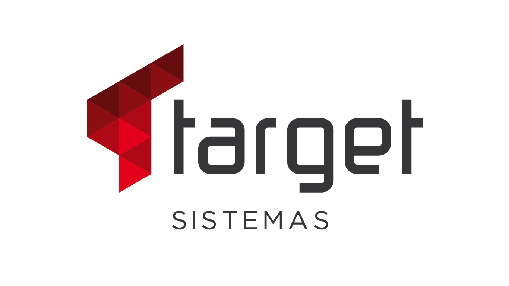

# Teste Target Sistemas
> Feito no dia 25/02 para a vaga de estágio em Análise e Desenvolvimento

 

Os algoritmos foram criados com muito amor, testados, revisados e depois tipados

## Instalação

<ol>
    <li>Clone o projeto</li> 
    <li>Baixe Python e uma IDE</li> 
    <li>Abra o terminal e execute:</li> 
    <code>python3 -m venv venv source venv/bin/activate</code> (Linux)<code> venv/Scripts/Activate</code> (Windows) <code> pip install -r requirements.txt</code>  
</ol>

## How to use it

<ol>
    <li>Na sua IDE, execute o arquivo da sua escolha</li> 
    OU  
    <li>Abra o terminal na pasta onde foi clonado o projeto, e digite  
    <code>python3 {nome do arquivo}.py</code>
</ol>

## Meta
 

<h2>Guilherme Bracero Gonzales</h2>

 

LinkedIN - [Guilherme Bracero](https://www.linkedin.com/in/guilherme-bracero/)
 
Instagram - [Bracero](https://instagram.com/guilhermebracero)
 
Email - [guibragon@gmail.com](www.gmail.com) 